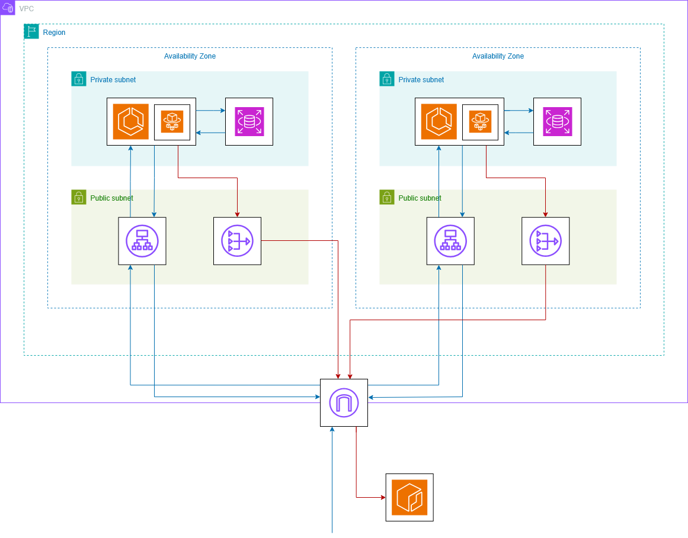

# FitTech - REST API for Fitness and Nutrition App

## Description
I built this project to learn the whole production cycle, from code to deployment. It includes:
- A REST API implemented in Python's FastAPI that uses a relational PostgreSQL database, providing the necessary functionalities for an app related with Fitness and Nutrition, handling authentication, database integration and HTTPS methods.
- Containerization with Docker and Docker Compose, allowing the app to run anywhere, including distributed systems, even without a database in the formal sense, by using Docker Compose to orchestrate the connection between the app container and the PostgreSQL database container with ease.
- Terraform infrastructure code to deploy the code in a working AWS architecture I designed for high availability, scalability and security. It uses ECS Fargate for the app containers and RDS for the database.
- A complete CI/CD pipeline, automating quality and security controls and deployment to the cloud, using Github Actions. Also, I developed unit and integration tests for this pipeline, learning pytest in the process.
- Migrated the app to Kubernetes, from ECS to EKS, to improve container orchestration and make it easier for the app to adopt a microservices architecture rather than a monolith one, even though the migration was done in a different repository in this account to not change what I already built.

This README includes documentation about the REST API and how to run it locally with Docker, while the infra/ folder has a README specifically for Terraform and the AWS architecture, being the following image a diagram of it. The CI/CD pipeline is documented too with a README, which is in the .github/workflows/ folder. It's recommended to read any README related with the part of this project that you are interested the most.



## Setup
To run the application locally, make sure you have Docker CLI installed and updated to the latest version and run the following command: 
```
docker-compose up --build
```

To stop the application:
```
docker-compose down
```

## Database schemas
- Users: minimal user information
- Onboarding: physical and health data.
- Food-logs: registered foods.
- Workout-logs: registered workouts.

## Methods
- POST auth/register: creates a new user.
- POST auth/token: login a user and provides a temporary JWT token.
- POST users/{user_id}/onboarding: uploads the user's onboarding data.
- GET users/{user_id}/onboarding: returns the user's onboarding data.
- PUT users/{user_id}/onboarding: updates the user's onboarding data.
- POST users/{user_id}/food-logs: uploads a food log.
- GET users/{user_id}/food-logs: returns all the user's food logs.
- POST users/{user_id}/workout-logs: uploads a workout log.
- GET users/{user_id}/workout-logs: returns all the user's workout logs.
- GET dashboard: returns a JSON with the user's BMR and TDEE metrics, macros requirements, the total calories, protein, carbs, and fat consumed, and all the food and workout logs from today.
