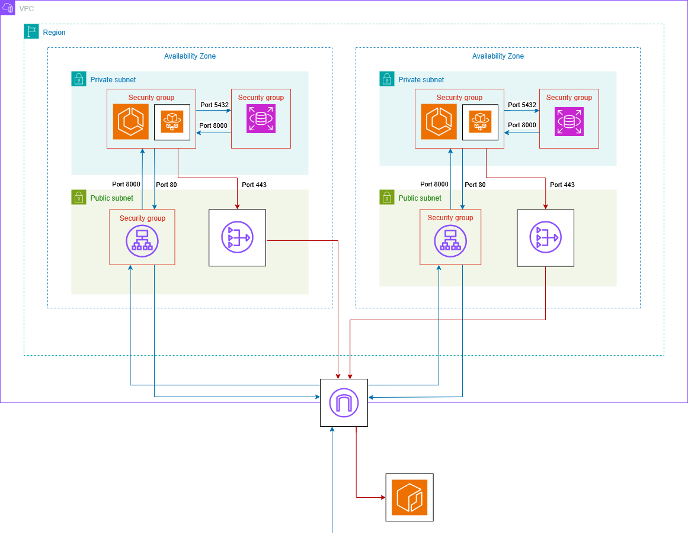

# Infrastructure

## Description
The Terraform infrastructure code deploys a working architecture in AWS, focusing on high availability across multiple AZs (Availability Zones) in the same region, security, making sure that the app containers and the databases do not have access direct access to the internet, and scalability, since ECS Fargate manages the containers, allowing an increase in the number of containers without dealing with managing new EC2 instances.

This project has taught me a lot about AWS, specially about networking and system design.

At the end, I show the Terraform commands for deploying the app and testing it yourself.

## Architecture
As you can see in the architecture in the following diagram, there is one region in the VPC, in my case us-east-1, since it's cheaper for experiments, and 2 AZs in that region. Inside each AZ there's a public and private subnet.
In the edge of the VPC, there's an IGW (Internet Gateway) connecting the VPC to the internet, allowing inbound and outbound traffic.

In the public subnet, there's a NAT (Network Address Translation) gateway that allows outbound traffic to the internet, shown in red arrows, allowing the ECS tasks (also called containers) to fetch the Docker images from the ECR (Elastic Container Registry), where I store the Docker images to be deployed. The NAT gateway uses port 443 for HTTPS. 
The ALB (Application Load Balancer) service is regional, using the ALB listener for inbound requests to route them to an element from the target group, in this case the ECS tasks, by passing the request to the ALB node from the AZ to which the target group element is located. It uses listening rules to determine to which element of the target group to route the traffic to. The ALB service spans across multiple AZs, being the ALB listener part of it, while the ALB nodes can only be in one AZ.

In the private subnet, there are ECS (Elastic Container Service) tasks, which are managed by the ECS service using Fargate to let AWS automatically manage the underlying infrastructure for those tasks, and these ones listen to port 8000 because the app is a FastAPI REST API. Besides the ECS tasks, there's an RDS (Relational Database Service) instance that uses PostgreSQL and listens to port 5432.

The red arrows, as I mentioned earlier, show the outbound connection from the ECS tasks to fetch the ECR image. The blue arrows show how a user request would be handled, with the ALB nodes receiving the incoming request, routing it to the corresponding element of the target group through one of the ALB nodes, in this case an ECS task, which would then interact with the RDS instance to obtain the information needed for the specific endpoint the user requests about.


## Networking

The following diagram shows the infrastructure from a perspective of networking. 

As you can see, each element of the VPC, except NAT gateways, has a security group, which controls the inbound and outbound traffic from each of them. Starting with subnets, the public subnets route traffic from the internet through IGW using the public route table, the private subnets route traffic to the internet through the NAT gateway.

In a private subnet, the ECS tasks, managed by the ECS service, are allowed inbound traffic from the ALB security group, listening to port 8000. The RDS instance is allowed inbound traffic from the ECS service security group and outbound traffic to the internet through the NAT gateway, and listens to the port 5432.

In a public subnet, the ALB nodes don't have by themselves a security group, but use the ALB security group, which forwards traffic to these nodes based on the listening rules from the ALB listener, which is a component of the ALB service and listens to port 80 for HTTP. The NAT gateway, as I mentioned before, does not have a security group and uses port 443 for HTTPS.



## Deployment commands
Terraform has to be previously installed, and for this project I specifically had version 1.12.0.

For setting up the Terraform environment:

```
terraform init
```

Create a deployment plan in the tfplan file:

```
terraform plan -out=tfplan
```

Deploy the infrastructure according to the plan in the tfplan file, without requiring human approval:

```
terraform apply -auto-approve tfplan
```

If you want to delete the whole infrastructure, again without needing human approval:

```
terraform destroy -auto-approve
```
